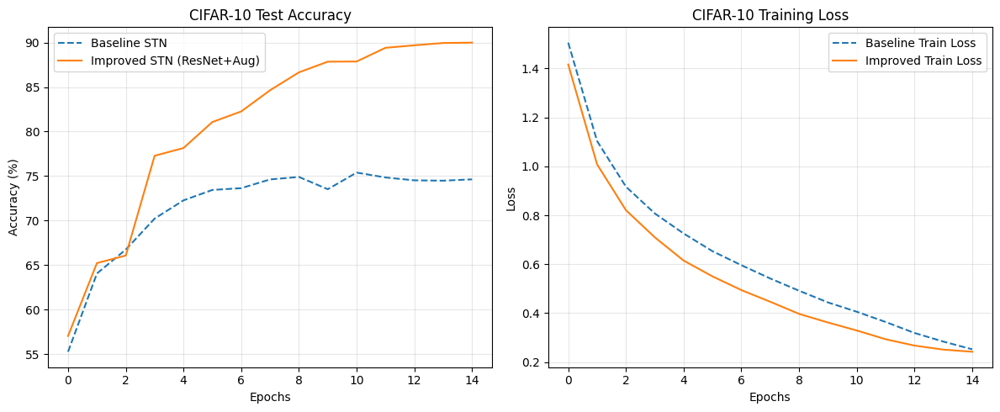
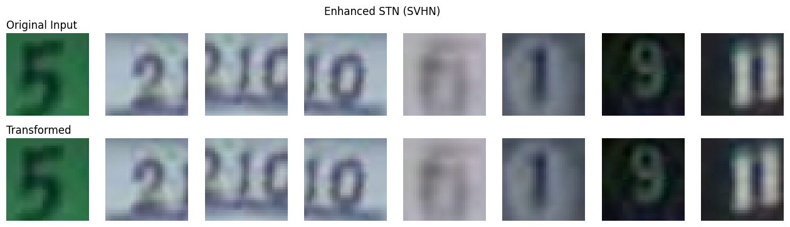
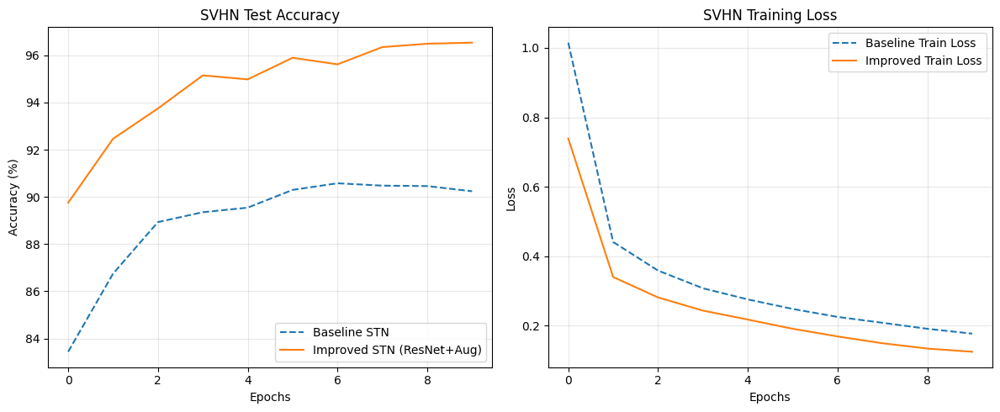
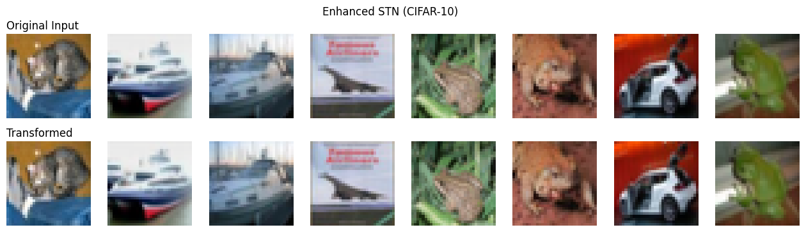
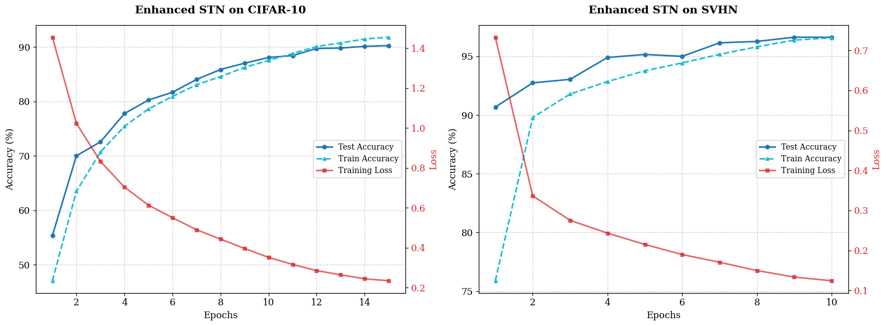

# Enhanced Spatial Transformer Networks: Baselines vs. Improved Models

## Overview
This project implements and evaluates Spatial Transformer Networks (STN) on CIFAR-10 and SVHN datasets. We aim to demonstrate the effectiveness of an Improved STN model incorporating a ResNet-based backbone, stronger data augmentation, and modern training techniques compared to a standard Baseline STN.

This repository contains the code for the final project submission for the Deep Learning course.

## Key Features
- **Baseline STN**: Standard implementation using a simple CNN backbone.
- **Improved STN**: Enhanced version featuring:
    - ResNet-18 backbone
    - Adaptive Transformation Budget (ATB)
    - Progressive STN Training
    - Stability Enhancements (Weight Normalization)
    - Regularization & Dropout
    - AdamW Optimizer & Cosine Annealing Scheduler

## Datasets
- **CIFAR-10**: 60,000 32x32 color images in 10 classes.
- **SVHN**: 73,257 digits for training, 26,032 for testing.

## Getting Started

### Prerequisites
Ensure you have Python installed (preferably 3.8+). The following libraries are required:
- `torch`
- `torchvision`
- `matplotlib`
- `numpy`
- `tqdm`

You can install the dependencies using pip:
```bash
pip install torch torchvision matplotlib numpy tqdm
```

### Running the Code
The core implementation is contained within the Jupyter Notebook `final-combination.ipynb`.

To run the notebook locally:
1.  Clone this repository or download the source code.
2.  Navigate to the project directory.
3.  Start Jupyter Notebook:
    ```bash
    jupyter notebook "final-combination.ipynb"
    ```
4.  Run all cells to reproduce the training and evaluation steps.

### Online Execution
If you encounter issues running the code locally, you can view and run the notebook on Kaggle using the link below:

[**Run on Kaggle**](https://www.kaggle.com/code/ananyasing/improved-spacial-transformer-network-18cff5/notebook)

## Results
The following plots demonstrate the performance of our models.

### CIFAR-10 Performance

*Figure 1: Training vs Test performance on CIFAR-10.*


*Figure 2: Detailed metrics for the Enhanced STN on CIFAR-10.*

### SVHN Performance

*Figure 3: Training vs Test performance on SVHN.*


*Figure 4: Detailed metrics for the Enhanced STN on SVHN.*

### Training Dynamics

*Figure 5: Training loss comparison.*

## License
This project is licensed under the MIT License - see the [LICENSE](LICENSE) file for details.
